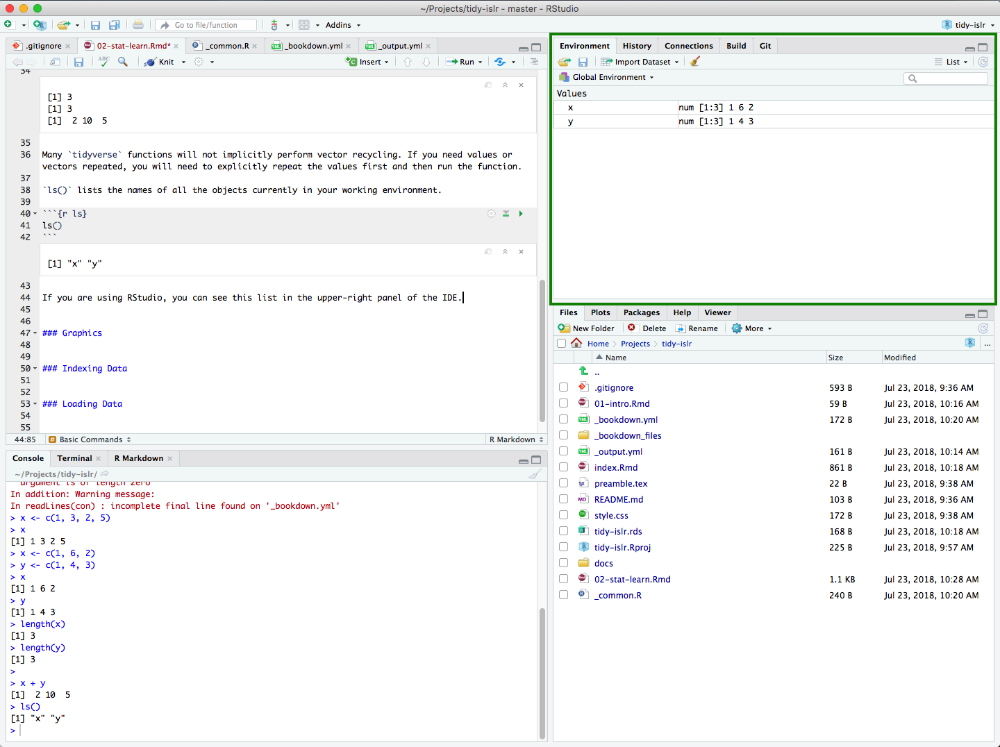
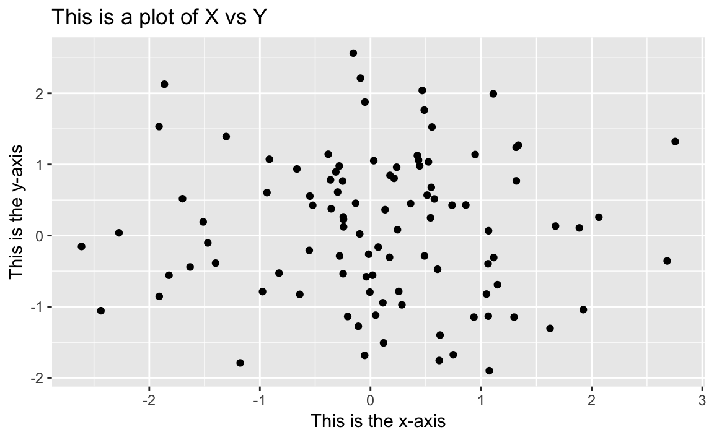
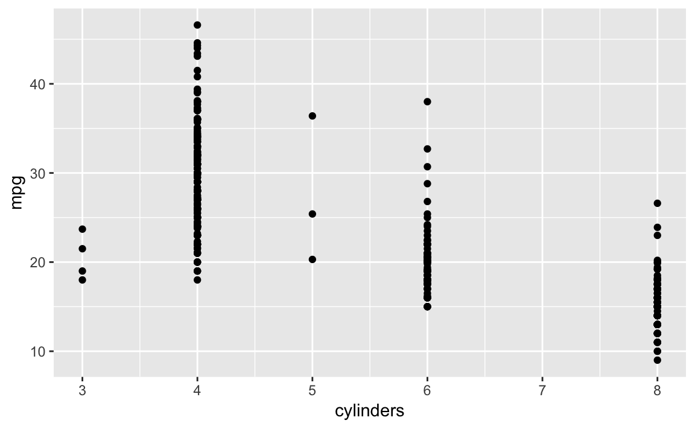
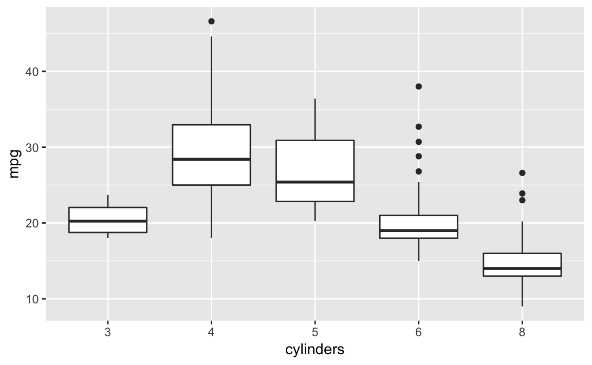
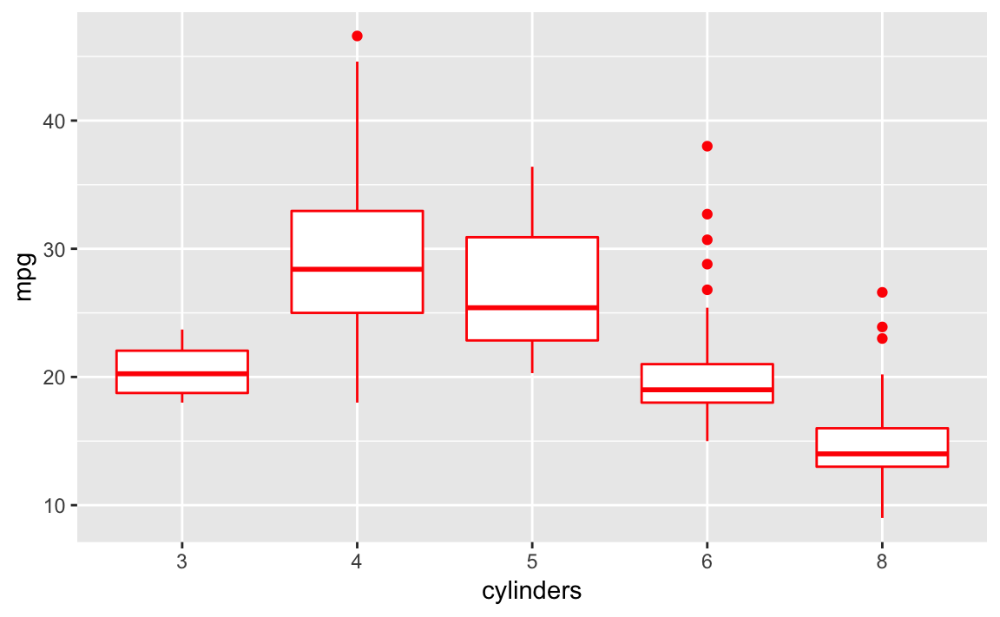
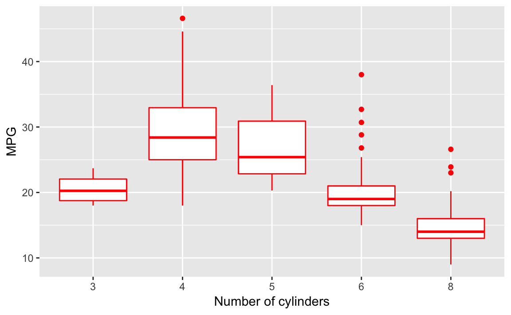
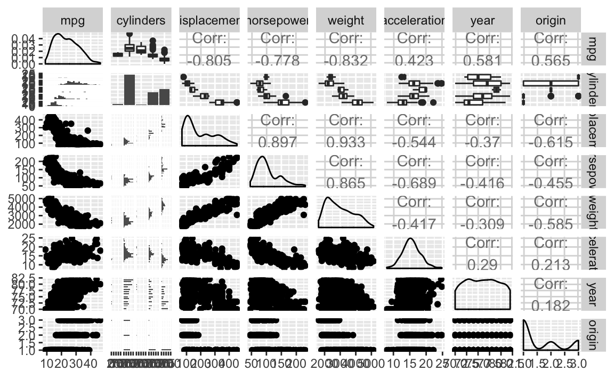

# What is statistical learning? {#stat-learn}

## What is statistical learning?


## Assessing model accuracy


## Lab: Introduction to R

### Basic commands


```r
x <- c(1, 3, 2, 5)
x
```

```
## [1] 1 3 2 5
```

Use the assignment operator `<-` to create new objects in R. Objects can be replaced (or overridden) by creating a new object with the same name.


```r
x <- c(1, 6, 2)
y <- c(1, 4, 3)
x
```

```
## [1] 1 6 2
```

```r
y
```

```
## [1] 1 4 3
```

R performs simple mathematical calculations. For instance, to add numbers use the `+` notation. This will add the first value of `x` to the first  value of `y`, and so on. R uses vector recycling if you try to combine vectors that are not the same length, so use `length()` to confirm that `x` and `y` contain the same number of values.


```r
length(x)
```

```
## [1] 3
```

```r
length(y)
```

```
## [1] 3
```

```r
x + y
```

```
## [1]  2 10  5
```

Many tidyverse functions will not implicitly perform vector recycling. If you need values or vectors repeated, you will need to explicitly repeat the values first and then run the function.

`ls()` lists the names of all the objects currently in your working environment.


```r
ls()
```

```
## [1] "x" "y"
```

If you are using RStudio, you can see this list in the upper-right panel of the IDE:



Most tidyverse functions assume your data is stored in a **data frame**. A data frame is a spreadsheet style data object which stores values in columns and rows. A [**tidy data frame**](http://r4ds.had.co.nz/tidy-data.html) adheres to three basic principles:

1. Each variable must have its own column
1. Each observation must have its own row
1. Each value must have its own cell

**Tibbles** are a special type of data frame which work nicely with tidyverse packages and RStudio. To create a tibble, we first need to load the `tibble` package. Packages in R contain additional functions which build new features onto the base R software. Packages are loaded using the `library()` function, at which point all the functions in the library are now directly accessible. Use `install.packages()` if you do not yet have this package installed:

```r
install.packages("tibble")
```


```r
library(tibble)
```

To create a tibble, we use the `tibble()` function:


```r
tibble(
  x = 1:5,
  y = 1,
  z = x ^ 2 + y
)
```

```
## # A tibble: 5 x 3
##       x     y     z
##   <int> <dbl> <dbl>
## 1     1     1     2
## 2     2     1     5
## 3     3     1    10
## 4     4     1    17
## 5     5     1    26
```

Each column of a tibble is defined as a vector, and columns can be created either by individual vectors or by recycling inputs of length 1. You can also create variables that are derived from already created columns (hence `z`).

### Graphics

[`ggplot2`](https://ggplot2.tidyverse.org/) is the tidyverse preferred package for generating graphics in R. It is structured on the [layered grammar of graphics](https://www.tandfonline.com/doi/abs/10.1198/jcgs.2009.07098) and provides a consistent syntax for creating both basic and advanced statistical graphs.

> See the [data visualization cheat sheet](https://github.com/rstudio/cheatsheets/raw/master/data-visualization-2.1.pdf) for a summary of the core graphing functions in `ggplot2`.

For instance, to create a basic scatterplot:


```r
# create simulated data
scatter_data <- tibble(
  x = rnorm(100),
  y = rnorm(100)
)

library(ggplot2)    # load ggplot2

# generate scatterplot
ggplot(data = scatter_data, aes(x = x, y = y)) +
  geom_point()
```


`ggplot2` builds graphs in layers, so additional components are added using the `+` notation. To add labels to this graph, use the `labs()` function.


```r
ggplot(data = scatter_data, aes(x = x, y = y)) +
  geom_point() +
  labs(title = "This is a plot of X vs Y",
       x = "This is the x-axis",
       y = "This is the y-axis")
```



To export `ggplot()` objects, use `ggsave()`:

```r
x <- ggplot(data = scatter_data, aes(x = x, y = y)) +
  geom_point() +
  labs(title = "This is a plot of X vs Y",
       x = "This is the x-axis",
       y = "This is the y-axis")

ggsave(filename = "scatterplot.pdf", plot = x)
```

`ggplot2` is an excellent package for creating static two-dimensional graphs. For interactive or three-dimensional graphs, consider [plot.ly](https://plot.ly/r/) or [`highcharter`](http://jkunst.com/highcharter/).

### Indexing data

Sometimes you want to examine only a portion of a tibble. Beyond the [base R `[` and `[[` subsetting approaches](http://r4ds.had.co.nz/vectors.html#vector-subsetting), `dplyr` provides two core functions for subsetting a data frame. Consider the following tibble:


```r
df <- tibble(
  x = 1:5,
  y = 1,
  z = x ^ 2 + y
)
df
```

```
## # A tibble: 5 x 3
##       x     y     z
##   <int> <dbl> <dbl>
## 1     1     1     2
## 2     2     1     5
## 3     3     1    10
## 4     4     1    17
## 5     5     1    26
```

To subset specific rows, use `filter()`:


```r
library(dplyr)
```

```
## Warning: package 'dplyr' was built under R version 3.5.1
```

```
## 
## Attaching package: 'dplyr'
```

```
## The following objects are masked from 'package:stats':
## 
##     filter, lag
```

```
## The following objects are masked from 'package:base':
## 
##     intersect, setdiff, setequal, union
```

```r
filter(.data = df, x > 3)
```

```
## # A tibble: 2 x 3
##       x     y     z
##   <int> <dbl> <dbl>
## 1     4     1    17
## 2     5     1    26
```

```r
filter(.data = df, z < 5)
```

```
## # A tibble: 1 x 3
##       x     y     z
##   <int> <dbl> <dbl>
## 1     1     1     2
```

To subset specific columns, use `select()`:


```r
select(.data = df, x, y)
```

```
## # A tibble: 5 x 2
##       x     y
##   <int> <dbl>
## 1     1     1
## 2     2     1
## 3     3     1
## 4     4     1
## 5     5     1
```

```r
select(.data = df, -y)
```

```
## # A tibble: 5 x 2
##       x     z
##   <int> <dbl>
## 1     1     2
## 2     2     5
## 3     3    10
## 4     4    17
## 5     5    26
```

### Loading data

To import rectangular data files like `.csv` or `.tsv`, use `read_csv()` or `read_tsv()` from the [`readr`](https://readr.tidyverse.org/) package:


```r
library(readr)

Auto <- read_csv("data/auto.csv")
```

```
## Parsed with column specification:
## cols(
##   mpg = col_double(),
##   cylinders = col_integer(),
##   displacement = col_double(),
##   horsepower = col_integer(),
##   weight = col_double(),
##   acceleration = col_double(),
##   year = col_integer(),
##   origin = col_integer(),
##   name = col_character()
## )
```

```r
Auto
```

```
## # A tibble: 392 x 9
##     mpg cylinders displacement horsepower weight acceleration  year origin
##   <dbl>     <int>        <dbl>      <int>  <dbl>        <dbl> <int>  <int>
## 1    18         8          307        130   3504         12      70      1
## 2    15         8          350        165   3693         11.5    70      1
## 3    18         8          318        150   3436         11      70      1
## 4    16         8          304        150   3433         12      70      1
## 5    17         8          302        140   3449         10.5    70      1
## 6    15         8          429        198   4341         10      70      1
## # ... with 386 more rows, and 1 more variable: name <chr>
```

`read_()` functions automatically decode each column type, a header row (if available), and import the data quickly and efficiently. Generally these guesses for column type are accurate, though they can always be manually defined. To import other file types, consider these packages:

* [`haven`](https://haven.tidyverse.org/) - SAS, SPSS, and Stata
* [`readxl`](https://readxl.tidyverse.org/) - Excel
* [`googledrive`](https://googledrive.tidyverse.org/) - Google Sheets

### Additional graphical and numerical summaries

Variable names are passed to `ggplot()` using the `aes()` function.


```r
ggplot(data = Auto, aes(x = cylinders, y = mpg)) +
  geom_point()
```



Since `cylinders` is essentially a categorical variable (not enough unique values to be considered continuous), we could store it as a qualitative variable using `as.factor()` and then visualize this data using a **boxplot**. To convert a column in-place, we use `mutate()` from the `dplyr` package:


```r
# convert cylinders to a factor variable
Auto <- mutate(.data = Auto,
               cylinders = as.factor(cylinders))
Auto
```

```
## # A tibble: 392 x 9
##     mpg cylinders displacement horsepower weight acceleration  year origin
##   <dbl> <fct>            <dbl>      <int>  <dbl>        <dbl> <int>  <int>
## 1    18 8                  307        130   3504         12      70      1
## 2    15 8                  350        165   3693         11.5    70      1
## 3    18 8                  318        150   3436         11      70      1
## 4    16 8                  304        150   3433         12      70      1
## 5    17 8                  302        140   3449         10.5    70      1
## 6    15 8                  429        198   4341         10      70      1
## # ... with 386 more rows, and 1 more variable: name <chr>
```

```r
ggplot(data = Auto, aes(x = cylinders, y = mpg)) +
  geom_boxplot()
```



The visual appearance of the boxplot can be customized using either additional arguments to `geom_boxplot()` or adding additional components:


```r
ggplot(data = Auto, aes(x = cylinders, y = mpg)) +
  geom_boxplot(color = "red")

ggplot(data = Auto, aes(x = cylinders, y = mpg)) +
  geom_boxplot(color = "red") +
  labs(x = "Number of cylinders",
       y = "MPG")
```



To create a scatterplot matrix, use `ggpairs()` from the [`GGally`](http://ggobi.github.io/ggally/index.html) package:


```r
library(GGally)
```

```
## 
## Attaching package: 'GGally'
```

```
## The following object is masked from 'package:dplyr':
## 
##     nasa
```

```r
ggpairs(data = select(.data = Auto, -name))
```

```
## `stat_bin()` using `bins = 30`. Pick better value with `binwidth`.
```

```
## `stat_bin()` using `bins = 30`. Pick better value with `binwidth`.
## `stat_bin()` using `bins = 30`. Pick better value with `binwidth`.
## `stat_bin()` using `bins = 30`. Pick better value with `binwidth`.
## `stat_bin()` using `bins = 30`. Pick better value with `binwidth`.
## `stat_bin()` using `bins = 30`. Pick better value with `binwidth`.
## `stat_bin()` using `bins = 30`. Pick better value with `binwidth`.
```



We need to exclude the `name` column because it is just an ID column - there is nothing informative in this column to create a scatterplot matrix. We could also write this code using the [**pipe operator**](http://r4ds.had.co.nz/pipes.html) `%>%` to first subset the tibble, then create the scatterplot matrix:


```r
select(.data = Auto, -name) %>%
  ggpairs()
```

```
## `stat_bin()` using `bins = 30`. Pick better value with `binwidth`.
## `stat_bin()` using `bins = 30`. Pick better value with `binwidth`.
## `stat_bin()` using `bins = 30`. Pick better value with `binwidth`.
## `stat_bin()` using `bins = 30`. Pick better value with `binwidth`.
## `stat_bin()` using `bins = 30`. Pick better value with `binwidth`.
## `stat_bin()` using `bins = 30`. Pick better value with `binwidth`.
## `stat_bin()` using `bins = 30`. Pick better value with `binwidth`.
```


Piped operations are a powerful tool in the tidyverse to write human-readable code that clearly defines each step of a multi-operation chunk of code.

## Install and load tidyverse packages

The easiest method to install and load tidyverse packages is to install `tidyverse`. This package automatically downloads and installs the [complete tidyverse](https://www.tidyverse.org/packages/). When you load the package with `library(tidyverse)`, it will automatically load the core tidyverse and make it available in your current R session. The core tidyverse is a set of packages you are likely to use in everyday data analyses. All other tidyverse packages can be loaded directly using `library()`.

```r
install.packages("tidyverse")
```


```r
library(tidyverse)
```

```
## ── Attaching packages ───────────────────────────────────────── tidyverse 1.2.1 ──
```

```
## ✔ tidyr   0.8.1     ✔ stringr 1.3.1
## ✔ purrr   0.2.5     ✔ forcats 0.3.0
```

```
## ── Conflicts ──────────────────────────────────────────── tidyverse_conflicts() ──
## ✖ dplyr::filter() masks stats::filter()
## ✖ dplyr::lag()    masks stats::lag()
```


## Session information {.toc-ignore}


```r
devtools::session_info()
```

```
## Session info -------------------------------------------------------------
```

```
##  setting  value                       
##  version  R version 3.5.0 (2018-04-23)
##  system   x86_64, darwin15.6.0        
##  ui       X11                         
##  language (EN)                        
##  collate  en_US.UTF-8                 
##  tz       America/Chicago             
##  date     2018-07-23
```

```
## Packages -----------------------------------------------------------------
```

```
##  package   * version date       source        
##  backports   1.1.2   2017-12-13 CRAN (R 3.5.0)
##  base      * 3.5.0   2018-04-24 local         
##  bookdown    0.7     2018-02-18 CRAN (R 3.5.0)
##  compiler    3.5.0   2018-04-24 local         
##  datasets  * 3.5.0   2018-04-24 local         
##  devtools    1.13.5  2018-02-18 CRAN (R 3.5.0)
##  digest      0.6.15  2018-01-28 CRAN (R 3.5.0)
##  evaluate    0.10.1  2017-06-24 CRAN (R 3.5.0)
##  graphics  * 3.5.0   2018-04-24 local         
##  grDevices * 3.5.0   2018-04-24 local         
##  hms         0.4.2   2018-03-10 CRAN (R 3.5.0)
##  htmltools   0.3.6   2017-04-28 CRAN (R 3.5.0)
##  ISLR        1.2     2017-10-20 CRAN (R 3.5.0)
##  knitr       1.20    2018-02-20 CRAN (R 3.5.0)
##  magrittr    1.5     2014-11-22 CRAN (R 3.5.0)
##  memoise     1.1.0   2017-04-21 CRAN (R 3.5.0)
##  methods   * 3.5.0   2018-04-24 local         
##  pillar      1.2.3   2018-05-25 CRAN (R 3.5.0)
##  pkgconfig   2.0.1   2017-03-21 CRAN (R 3.5.0)
##  R6          2.2.2   2017-06-17 CRAN (R 3.5.0)
##  Rcpp        0.12.17 2018-05-18 CRAN (R 3.5.0)
##  readr     * 1.1.1   2017-05-16 CRAN (R 3.5.0)
##  rlang       0.2.1   2018-05-30 CRAN (R 3.5.0)
##  rmarkdown   1.9     2018-03-01 CRAN (R 3.5.0)
##  rprojroot   1.3-2   2018-01-03 CRAN (R 3.5.0)
##  stats     * 3.5.0   2018-04-24 local         
##  stringi     1.2.2   2018-05-02 CRAN (R 3.5.0)
##  stringr     1.3.1   2018-05-10 CRAN (R 3.5.0)
##  tibble      1.4.2   2018-01-22 CRAN (R 3.5.0)
##  tools       3.5.0   2018-04-24 local         
##  utils     * 3.5.0   2018-04-24 local         
##  withr       2.1.2   2018-03-15 CRAN (R 3.5.0)
##  xfun        0.1     2018-01-22 CRAN (R 3.5.0)
##  yaml        2.1.19  2018-05-01 CRAN (R 3.5.0)
```
