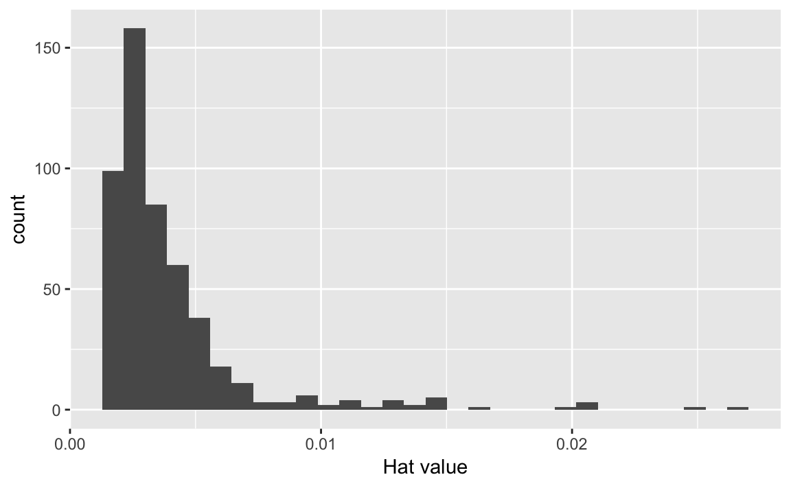

# Linear regression {#lin-reg}


```r
library(tidyverse)
```

```
## ── Attaching packages ───────────────────────────────────────── tidyverse 1.2.1 ──
```

```
## ✔ ggplot2 3.0.0     ✔ purrr   0.2.5
## ✔ tibble  1.4.2     ✔ dplyr   0.7.6
## ✔ tidyr   0.8.1     ✔ stringr 1.3.1
## ✔ readr   1.1.1     ✔ forcats 0.3.0
```

```
## Warning: package 'dplyr' was built under R version 3.5.1
```

```
## ── Conflicts ──────────────────────────────────────────── tidyverse_conflicts() ──
## ✖ dplyr::filter() masks stats::filter()
## ✖ dplyr::lag()    masks stats::lag()
```

## Simple linear regression


## Multiple linear regression


## Other considerations in the regression model


## The marketing plan


## Comparison of linear regression with $K$-nearest neighbors


## Lab: Linear regression


### Libraries

`ISLR` contains several datasets associated with **An Introduction to Statistical Learning**. `MASS` also contains a large number of data sets and functions, one of which is used in this lab. However `MASS` also contains a function called `filter()`, which would conflict with `filter()` from `dplyr`. To avoid this conflict, we can use `data()` to directly access the data frame without loading the entire `MASS` package. We then convert this data frame to a tibble using `as_tibble()` to ensure proper formatting and appearance.


```r
library(ISLR)
data(Boston, package = "MASS")

Boston <- as_tibble(Boston)
Boston
```

```
## # A tibble: 506 x 14
##      crim    zn indus  chas   nox    rm   age   dis   rad   tax ptratio
## *   <dbl> <dbl> <dbl> <int> <dbl> <dbl> <dbl> <dbl> <int> <dbl>   <dbl>
## 1 0.00632    18  2.31     0 0.538  6.58  65.2  4.09     1   296    15.3
## 2 0.0273      0  7.07     0 0.469  6.42  78.9  4.97     2   242    17.8
## 3 0.0273      0  7.07     0 0.469  7.18  61.1  4.97     2   242    17.8
## 4 0.0324      0  2.18     0 0.458  7.00  45.8  6.06     3   222    18.7
## 5 0.0690      0  2.18     0 0.458  7.15  54.2  6.06     3   222    18.7
## 6 0.0298      0  2.18     0 0.458  6.43  58.7  6.06     3   222    18.7
## # ... with 500 more rows, and 3 more variables: black <dbl>, lstat <dbl>,
## #   medv <dbl>
```

### Simple linear regression

`Boston` is a dataset of neighborhood statistics for 506 neighborhoods around Boston, Massachusetts. We will attempt to predict `medv` (median value of owner-occupied homes in \$1000s) using 13 predictors such as `rm` (average number of rooms per house), `age` (average age of houses), and `lstat` (percent of households with low socioeconomic status). To estimate a linear regression model in R, use the core `lm()` function. The syntax is `lm(response ~ predictors, data = dataframe)`, like this:


```r
lm_fit <- lm(medv ~ lstat, data = Boston)
```

To view a summary of the linear regression model, the base R approach uses `summary()`:


```r
summary(lm_fit)
```

```
## 
## Call:
## lm(formula = medv ~ lstat, data = Boston)
## 
## Residuals:
##    Min     1Q Median     3Q    Max 
## -15.17  -3.99  -1.32   2.03  24.50 
## 
## Coefficients:
##             Estimate Std. Error t value Pr(>|t|)    
## (Intercept)  34.5538     0.5626    61.4   <2e-16 ***
## lstat        -0.9500     0.0387   -24.5   <2e-16 ***
## ---
## Signif. codes:  0 '***' 0.001 '**' 0.01 '*' 0.05 '.' 0.1 ' ' 1
## 
## Residual standard error: 6.22 on 504 degrees of freedom
## Multiple R-squared:  0.544,	Adjusted R-squared:  0.543 
## F-statistic:  602 on 1 and 504 DF,  p-value: <2e-16
```

This prints some output to the console, including information about the coefficients, standard errors, and overall model statistics. This approach is not tidy because the object containing all this information is not a data frame. Instead, we can use the [`broom` package](https://broom.tidyverse.org/) to summarize and extract key information about statistical models in tidy `tibble`s. To view summaries about each component of the model (in this case, the regression coefficients), use `tidy()`:


```r
library(broom)

tidy(lm_fit)
```

```
##          term estimate std.error statistic   p.value
## 1 (Intercept)    34.55    0.5626      61.4 3.74e-236
## 2       lstat    -0.95    0.0387     -24.5  5.08e-88
```

`glance()` returns a tibble with one row of goodness of fit measures and related statistics.


```r
glance(lm_fit)
```

```
##   r.squared adj.r.squared sigma statistic  p.value df logLik  AIC  BIC
## 1     0.544         0.543  6.22       602 5.08e-88  2  -1641 3289 3302
##   deviance df.residual
## 1    19472         504
```

`augment()` returns a data frame with one row per observation from the original dataset and adds information such as fitted values, residuals, etc.


```r
augment(lm_fit) %>%
  as_tibble()
```

```
## # A tibble: 506 x 9
##    medv lstat .fitted .se.fit .resid    .hat .sigma   .cooksd .std.resid
##   <dbl> <dbl>   <dbl>   <dbl>  <dbl>   <dbl>  <dbl>     <dbl>      <dbl>
## 1  24    4.98    29.8   0.406 -5.82  0.00426   6.22 0.00189       -0.939
## 2  21.6  9.14    25.9   0.308 -4.27  0.00246   6.22 0.000582      -0.688
## 3  34.7  4.03    30.7   0.433  3.97  0.00486   6.22 0.00100        0.641
## 4  33.4  2.94    31.8   0.467  1.64  0.00564   6.22 0.000198       0.264
## 5  36.2  5.33    29.5   0.396  6.71  0.00406   6.21 0.00238        1.08 
## 6  28.7  5.21    29.6   0.399 -0.904 0.00413   6.22 0.0000440     -0.146
## # ... with 500 more rows
```

To visualize the linear regression model, we can use `geom_smooth()`:


```r
ggplot(data = Boston, aes(x = lstat, y = medv)) +
  geom_point() +
  geom_smooth(method = "lm")
```


This not only draws the best fit line but also generates a 95% confidence interval.

Visualizing diagnostic plots can also be done using `augment()` and `ggplot()`. `augment()` automatically calculates statistics such as residuals and leverage statistics.


```r
augment(lm_fit) %>%
  ggplot(aes(x = .fitted, y = .resid)) +
  geom_point() +
  labs(x = "Fitted value",
       y = "Residual")

augment(lm_fit) %>%
  ggplot(aes(x = .fitted, y = .std.resid)) +
  geom_point() +
  labs(x = "Fitted value",
       y = "Standardized residual")

augment(lm_fit) %>%
  ggplot(aes(x = .hat)) +
  geom_histogram() +
  labs(x = "Hat value")
```

```
## `stat_bin()` using `bins = 30`. Pick better value with `binwidth`.
```



### Multiple linear regression

Again we use `lm()`, now specifying multiple predictors using `x1 + x2 + x3` notation.


```r
lm_fit <- lm(medv ~ lstat + age, data = Boston)
tidy(lm_fit)
```

```
##          term estimate std.error statistic   p.value
## 1 (Intercept)  33.2228    0.7308     45.46 2.94e-180
## 2       lstat  -1.0321    0.0482    -21.42  8.42e-73
## 3         age   0.0345    0.0122      2.83  4.91e-03
```

```r
glance(lm_fit)
```

```
##   r.squared adj.r.squared sigma statistic  p.value df logLik  AIC  BIC
## 1     0.551         0.549  6.17       309 2.98e-88  3  -1638 3283 3300
##   deviance df.residual
## 1    19168         503
```

To automatically regress on all of the available predictors:


```r
lm_fit <- lm(medv ~ ., data = Boston)
tidy(lm_fit)
```

```
##           term  estimate std.error statistic  p.value
## 1  (Intercept)  3.65e+01   5.10346    7.1441 3.28e-12
## 2         crim -1.08e-01   0.03286   -3.2865 1.09e-03
## 3           zn  4.64e-02   0.01373    3.3816 7.78e-04
## 4        indus  2.06e-02   0.06150    0.3343 7.38e-01
## 5         chas  2.69e+00   0.86158    3.1184 1.93e-03
## 6          nox -1.78e+01   3.81974   -4.6513 4.25e-06
## 7           rm  3.81e+00   0.41793    9.1161 1.98e-18
## 8          age  6.92e-04   0.01321    0.0524 9.58e-01
## 9          dis -1.48e+00   0.19945   -7.3980 6.01e-13
## 10         rad  3.06e-01   0.06635    4.6129 5.07e-06
## 11         tax -1.23e-02   0.00376   -3.2800 1.11e-03
## 12     ptratio -9.53e-01   0.13083   -7.2825 1.31e-12
## 13       black  9.31e-03   0.00269    3.4668 5.73e-04
## 14       lstat -5.25e-01   0.05072  -10.3471 7.78e-23
```

```r
glance(lm_fit)
```

```
##   r.squared adj.r.squared sigma statistic   p.value df logLik  AIC  BIC
## 1     0.741         0.734  4.75       108 6.72e-135 14  -1499 3028 3091
##   deviance df.residual
## 1    11079         492
```

Use `vif()` from the `car` package to calculate variance inflation factors (VIFs).


```r
library(car)
```

```
## Loading required package: carData
```

```
## 
## Attaching package: 'car'
```

```
## The following object is masked from 'package:dplyr':
## 
##     recode
```

```
## The following object is masked from 'package:purrr':
## 
##     some
```

```r
vif(lm_fit)
```

```
##    crim      zn   indus    chas     nox      rm     age     dis     rad 
##    1.79    2.30    3.99    1.07    4.39    1.93    3.10    3.96    7.48 
##     tax ptratio   black   lstat 
##    9.01    1.80    1.35    2.94
```

### Interaction terms

Use the syntax `lstat * age` to simultaneously include `lstat`, `age,` and the interaction term `lstat x age`. [Never omit constitutive terms.](https://doi.org/10.1093/pan/mpi014)


```r
lm(medv ~ lstat * age, data = Boston) %>%
  tidy()
```

```
##          term  estimate std.error statistic  p.value
## 1 (Intercept) 36.088536   1.46984   24.5528 4.91e-88
## 2       lstat -1.392117   0.16746   -8.3134 8.78e-16
## 3         age -0.000721   0.01988   -0.0363 9.71e-01
## 4   lstat:age  0.004156   0.00185    2.2443 2.52e-02
```

### Non-linear transformations of the predictors

Add non-linear transformations of predictors using `I(x ^ 2)` notation. So to add a second-order polynomial term:


```r
lm_fit2 <- lm(medv ~ lstat + I(lstat ^ 2), data = Boston)
tidy(lm_fit2)
```

```
##          term estimate std.error statistic   p.value
## 1 (Intercept)  42.8620   0.87208      49.1 3.50e-194
## 2       lstat  -2.3328   0.12380     -18.8  2.55e-60
## 3  I(lstat^2)   0.0435   0.00375      11.6  7.63e-28
```

Third and higher order terms are best implemented using `poly()`, which allows you to specify the highest-order term and all lower-order terms are automatically created.


```r
lm_fit5 <- lm(medv ~ poly(x = lstat, degree = 5), data = Boston)
tidy(lm_fit5)
```

```
##                           term estimate std.error statistic   p.value
## 1                  (Intercept)     22.5     0.232     97.20  0.00e+00
## 2 poly(x = lstat, degree = 5)1   -152.5     5.215    -29.24 2.69e-110
## 3 poly(x = lstat, degree = 5)2     64.2     5.215     12.32  1.25e-30
## 4 poly(x = lstat, degree = 5)3    -27.1     5.215     -5.19  3.10e-07
## 5 poly(x = lstat, degree = 5)4     25.5     5.215      4.88  1.42e-06
## 6 poly(x = lstat, degree = 5)5    -19.3     5.215     -3.69  2.47e-04
```

### Qualitative predictors

Examine the `CarSeats` data in the `ISLR` library.


```r
as_tibble(Carseats)
```

```
## # A tibble: 400 x 11
##   Sales CompPrice Income Advertising Population Price ShelveLoc   Age
## * <dbl>     <dbl>  <dbl>       <dbl>      <dbl> <dbl> <fct>     <dbl>
## 1  9.5        138     73          11        276   120 Bad          42
## 2 11.2        111     48          16        260    83 Good         65
## 3 10.1        113     35          10        269    80 Medium       59
## 4  7.4        117    100           4        466    97 Medium       55
## 5  4.15       141     64           3        340   128 Bad          38
## 6 10.8        124    113          13        501    72 Bad          78
## # ... with 394 more rows, and 3 more variables: Education <dbl>,
## #   Urban <fct>, US <fct>
```

While some of the variables are continuous, others such as `ShelveLoc` (quality of shelf location) are qualitative. `ShelveLoc` takes on three possible values: *Bad*, *Medium*, and *Good*. Given qualitative variables, R automatically converts them to a series of dummy variables with `0/1` coding:


```r
lm_fit <- lm(Sales ~ . + Income:Advertising + Price:Age, data = Carseats)
tidy(lm_fit)
```

```
##                  term  estimate std.error statistic   p.value
## 1         (Intercept)  6.575565  1.008747     6.519  2.22e-10
## 2           CompPrice  0.092937  0.004118    22.567  1.64e-72
## 3              Income  0.010894  0.002604     4.183  3.57e-05
## 4         Advertising  0.070246  0.022609     3.107  2.03e-03
## 5          Population  0.000159  0.000368     0.433  6.65e-01
## 6               Price -0.100806  0.007440   -13.549  1.74e-34
## 7       ShelveLocGood  4.848676  0.152838    31.724 1.38e-109
## 8     ShelveLocMedium  1.953262  0.125768    15.531  1.34e-42
## 9                 Age -0.057947  0.015951    -3.633  3.18e-04
## 10          Education -0.020852  0.019613    -1.063  2.88e-01
## 11           UrbanYes  0.140160  0.112402     1.247  2.13e-01
## 12              USYes -0.157557  0.148923    -1.058  2.91e-01
## 13 Income:Advertising  0.000751  0.000278     2.698  7.29e-03
## 14          Price:Age  0.000107  0.000133     0.801  4.24e-01
```

### Writing functions


## Session information {.toc-ignore}


```r
devtools::session_info()
```

```
## Session info -------------------------------------------------------------
```

```
##  setting  value                       
##  version  R version 3.5.0 (2018-04-23)
##  system   x86_64, darwin15.6.0        
##  ui       X11                         
##  language (EN)                        
##  collate  en_US.UTF-8                 
##  tz       America/Chicago             
##  date     2018-07-23
```

```
## Packages -----------------------------------------------------------------
```

```
##  package   * version date       source        
##  backports   1.1.2   2017-12-13 CRAN (R 3.5.0)
##  base      * 3.5.0   2018-04-24 local         
##  bookdown    0.7     2018-02-18 CRAN (R 3.5.0)
##  compiler    3.5.0   2018-04-24 local         
##  datasets  * 3.5.0   2018-04-24 local         
##  devtools    1.13.5  2018-02-18 CRAN (R 3.5.0)
##  digest      0.6.15  2018-01-28 CRAN (R 3.5.0)
##  evaluate    0.10.1  2017-06-24 CRAN (R 3.5.0)
##  graphics  * 3.5.0   2018-04-24 local         
##  grDevices * 3.5.0   2018-04-24 local         
##  htmltools   0.3.6   2017-04-28 CRAN (R 3.5.0)
##  knitr       1.20    2018-02-20 CRAN (R 3.5.0)
##  magrittr    1.5     2014-11-22 CRAN (R 3.5.0)
##  memoise     1.1.0   2017-04-21 CRAN (R 3.5.0)
##  methods   * 3.5.0   2018-04-24 local         
##  Rcpp        0.12.17 2018-05-18 CRAN (R 3.5.0)
##  rmarkdown   1.9     2018-03-01 CRAN (R 3.5.0)
##  rprojroot   1.3-2   2018-01-03 CRAN (R 3.5.0)
##  stats     * 3.5.0   2018-04-24 local         
##  stringi     1.2.2   2018-05-02 CRAN (R 3.5.0)
##  stringr     1.3.1   2018-05-10 CRAN (R 3.5.0)
##  tools       3.5.0   2018-04-24 local         
##  utils     * 3.5.0   2018-04-24 local         
##  withr       2.1.2   2018-03-15 CRAN (R 3.5.0)
##  xfun        0.1     2018-01-22 CRAN (R 3.5.0)
##  yaml        2.1.19  2018-05-01 CRAN (R 3.5.0)
```
